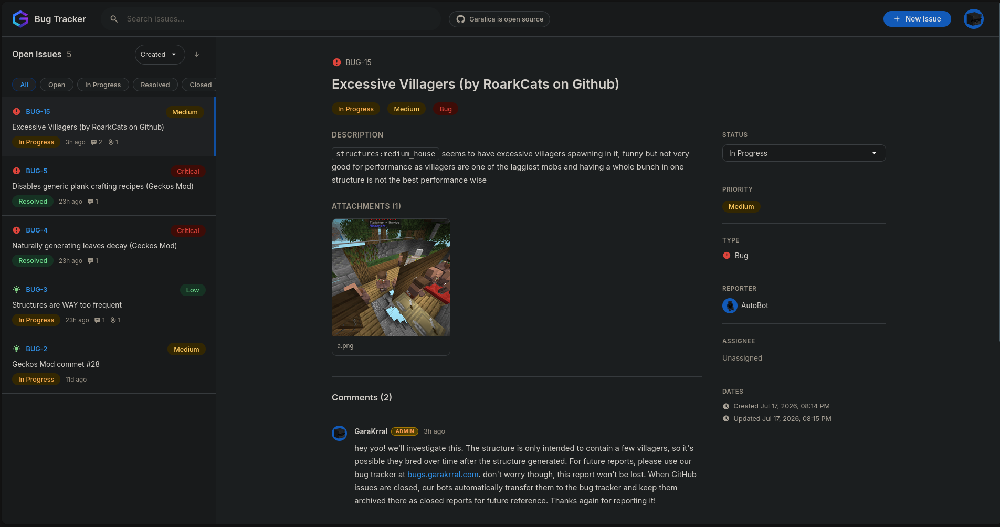

# Garalica

A modern issue tracker built with React, FastAPI, PostgreSQL, and Docker.



## Quick Start

### Requirements

- Docker
- Docker Compose

### Install

Clone the repository:

```bash
git clone https://github.com/Garalica/garalica.git
cd garalica
```

Download the latest Docker images:

```bash
docker pull ghcr.io/garalica/garalica-backend:latest
docker pull ghcr.io/garalica/garalica-frontend:latest
```

Create the configuration file:

```bash
cp .env.example .env
nano .env
```

Start Garalica:

```bash
docker compose up -d
```

Open:

```
http://localhost:7605
```

The admin account is created automatically on the first startup using the values in `.env`.

### Deployment

```bash
./scripts/deploy.sh -s your-server.com -u root -e
```

On Windows PowerShell:

```powershell
.\scripts\deploy.ps1 -ServerHost your-server.com -User root -IncludeEnv
```

Both scripts run the deploy inside a remote tmux session and support a dry run with `-n`.

## Architecture

```
Nginx (7605) -> Frontend (React SPA)
            -> Backend (FastAPI :8000) -> PostgreSQL :5432
```

Nginx routes `/api/` and `/uploads/` to the backend and serves the React build for everything else. The compose stack has four services: `db`, `backend`, `frontend`, and `nginx`, with persistent volumes for the database and uploaded files.

## Features

### Authentication

- JWT access and refresh tokens
- Registration, login, and token refresh
- Email verification with 6-digit codes, valid for 15 minutes
- Two-minute cooldown between code resend requests
- Automatic token refresh on the client, with 401 retry
- Auto-login after registration
- Admin account seeded on first startup

### Issues

- Create issues with title, description, priority, and type
- Types: bug, feature, task
- Priorities: critical, high, medium, low
- Statuses: open, in progress, resolved, closed
- Sequential issue keys, for example BUG-1, BUG-2
- Reporter and admins can update and delete an issue
- Status changes notify the reporter and all admins by email

### Browsing

- Search across issue title and key
- Filter by status, reporter, or assignee
- Sort by created or updated date, ascending or descending
- Pagination, 20 per page by default, up to 100

### Comments

- Add, edit, and delete comments on any issue
- Markdown rendering with GFM
- Authors and admins can modify or remove their own or others' comments
- New comments notify the issue reporter and admins

### Attachments

- Upload images and videos to an issue
- Images: JPEG, PNG, GIF, WebP
- Videos: MP4, WebM, QuickTime, AVI
- Size limits configurable via `MAX_IMAGE_SIZE` and `MAX_VIDEO_SIZE`
- Files stored on disk under `/app/uploads/{ISSUE_KEY}/`
- Listing and deletion available to the uploader or an admin

### Profiles

- Public profile pages at `/profiles/{username}`
- Editable display name, bio, README in Markdown, and links to website, GitHub, and Twitter/X
- Avatar upload, JPEG/PNG/GIF/WebP, up to 5 MB
- Per-user issue and comment counts
- Profiles and avatars editable by the owner or an admin

### Admins

- Admin badge shown across the navbar, profile, and comments
- Admins can edit and delete any issue or comment
- Admins receive email notifications for new issues, comments, and status changes

### Email

- Sent through Resend
- Verification codes on registration
- New issue notifications to admins
- Comment notifications to the issue reporter
- Status change notifications to the reporter
- Silently mocked when `RESEND_API_KEY` is empty, useful for local development

### Frontend

- Clean Google-style interface
- Framer Motion transitions throughout
- Dashboard with a sidebar list and a detail pane
- Search bar in the navbar
- User menu with profile, my issues, and sign out
- Paginated list with collapsed ranges for many pages
- 404 page for unknown routes

## Tech Stack

| Component | Technology |
|---|---|
| Frontend | React 18, Vite, React Router, Framer Motion, Axios, react-markdown |
| Backend | FastAPI, SQLAlchemy 2.0, Pydantic v2, python-jose, passlib/bcrypt |
| Database | PostgreSQL 16 |
| Email | Resend |
| Proxy | Nginx |
| Containers | Docker, Docker Compose |

## API

### Auth

| Method | Endpoint | Description |
|---|---|---|
| POST | `/api/auth/register` | Create account |
| POST | `/api/auth/login` | Sign in |
| POST | `/api/auth/refresh` | Refresh access token |
| GET | `/api/auth/me` | Current user |
| POST | `/api/auth/send-verification-code` | Request a new verification code |
| POST | `/api/auth/verify-email` | Verify email with the code |

### Issues

| Method | Endpoint | Description |
|---|---|---|
| GET | `/api/issues` | List issues, with filter, search, sort, and pagination |
| POST | `/api/issues` | Create issue |
| GET | `/api/issues/{key}` | Get issue |
| PATCH | `/api/issues/{key}` | Update issue |
| DELETE | `/api/issues/{key}` | Delete issue |

### Comments

| Method | Endpoint | Description |
|---|---|---|
| GET | `/api/issues/{key}/comments` | List comments |
| POST | `/api/issues/{key}/comments` | Add comment |
| PATCH | `/api/issues/{key}/comments/{comment_id}` | Update comment |
| DELETE | `/api/issues/{key}/comments/{comment_id}` | Delete comment |

### Attachments

| Method | Endpoint | Description |
|---|---|---|
| GET | `/api/issues/{key}/attachments` | List attachments |
| POST | `/api/issues/{key}/attachments` | Upload file |
| DELETE | `/api/attachments/{attachment_id}` | Delete attachment |
| GET | `/api/uploads/{issue_key}/{filename}` | Serve uploaded file |

### Users

| Method | Endpoint | Description |
|---|---|---|
| GET | `/api/users/{username}` | View profile |
| PATCH | `/api/users/{username}` | Update profile, owner or admin |
| POST | `/api/users/{username}/avatar` | Upload avatar, owner or admin |

### Health

| Method | Endpoint | Description |
|---|---|---|
| GET | `/api/health` | Health check |

## Configuration

All settings are read from `.env`. See `.env.example` for the defaults.

| Variable | Default | Description |
|---|---|---|
| `POSTGRES_USER` | `garalica` | Database user |
| `POSTGRES_PASSWORD` | required | Database password |
| `POSTGRES_DB` | `garalica` | Database name |
| `DATABASE_URL` | required | SQLAlchemy connection string |
| `SECRET_KEY` | required | JWT signing key |
| `ALGORITHM` | `HS256` | JWT algorithm |
| `ACCESS_TOKEN_EXPIRE_MINUTES` | `60` | Access token lifetime |
| `REFRESH_TOKEN_EXPIRE_DAYS` | `30` | Refresh token lifetime |
| `ADMIN_USERNAME` | `admin` | Seeded admin username |
| `ADMIN_EMAIL` | `admin@example.com` | Seeded admin email |
| `ADMIN_PASSWORD` | required | Seeded admin password |
| `MAX_IMAGE_SIZE` | `10485760` | Max image upload size in bytes |
| `MAX_VIDEO_SIZE` | `104857600` | Max video upload size in bytes |
| `RESEND_API_KEY` | empty | Resend API key, mocked when empty |
| `VITE_API_URL` | `http://localhost:7605/api` | Frontend API base URL |

## License


Licensed under the Apache License 2.0.
See LICENSE for details.
